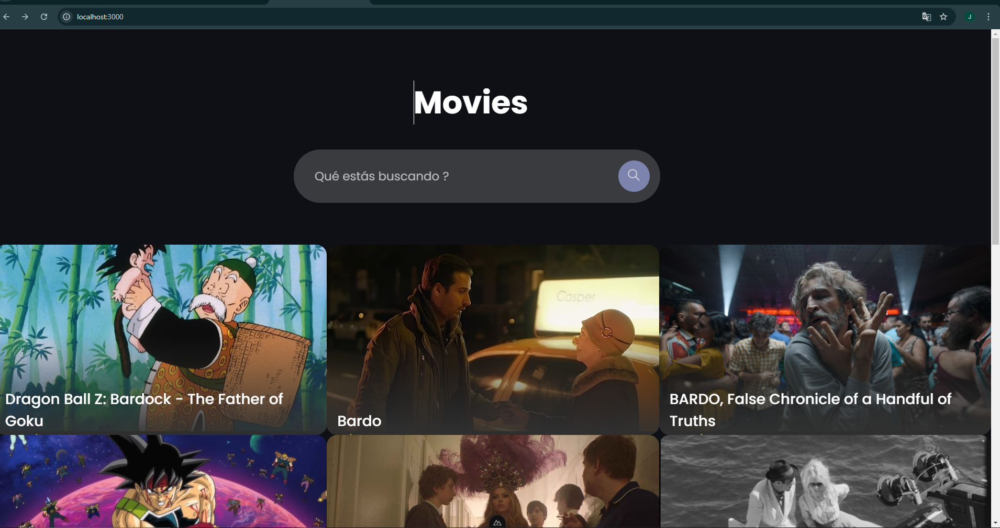
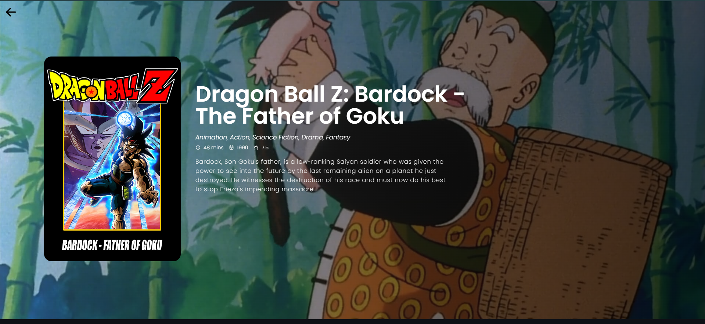

# Search Movies Nuxt

## Descripción
Search Movies Nuxt es una aplicación web desarrollada con Nuxt.js que permite a los usuarios buscar y explorar información sobre películas. Utiliza la API de The Movie Database (TMDb) para obtener datos actualizados sobre películas.

## Capturas de Pantalla

Aquí tienes algunas capturas de pantalla del proyecto:





## Link para probarlo
[https://search-movies-nuxt-production.up.railway.app/](https://search-movies-nuxt-production.up.railway.app/)

## Características
- Búsqueda de películas por título
- Visualización de detalles de películas, incluyendo sinopsis, calificación, género y fecha de lanzamiento
- Interfaz de usuario responsive y amigable
- Integración con la API de TMDb

## Tecnologías utilizadas
- Nuxt.js 3
- Vue.js 3
- TypeScript
- CSS3
- The Movie Database (TMDb) API

## Requisitos previos
- Node.js (versión 14.x o superior)
- npm o yarn

## Instalación
1. Clona el repositorio:
   ```
   git clone https://github.com/jaimecalderon19/Search-Movies-Nuxt.git
   ```
2. Navega al directorio del proyecto:
   ```
   cd search-movies-nuxt
   ```
3. Instala las dependencias:
   ```
   npm install
   ```
   o si usas yarn:
   ```
   yarn install
   ```

## Configuración
1. Crea una cuenta en [The Movie Database](https://www.themoviedb.org/) y obtén una API key.
2. Crea un archivo `.env` en la raíz del proyecto y añade tu API key:
   ```
   TMDB_API_KEY=tu_api_key_aquí
   ```

## Ejecución
Para ejecutar la aplicación en modo de desarrollo:
```
npm run dev
```
o si usas yarn:
```
yarn dev
```

La aplicación estará disponible en `http://localhost:3000`.

## Construcción para producción
Para construir la aplicación para producción:
```
npm run build
```
o si usas yarn:
```
yarn build
```

## Despliegue
Sigue la [documentación de Nuxt.js](https://nuxt.com/docs/getting-started/deployment) para obtener instrucciones sobre cómo desplegar tu aplicación en diferentes plataformas.


## Contacto
Jaime Calderon- jaimebc.yt@gmail.com

Enlace del proyecto: [https://github.com/jaimecalderon19/Search-Movies-Nuxt.git](https://github.com/jaimecalderon19/Search-Movies-Nuxt.git)